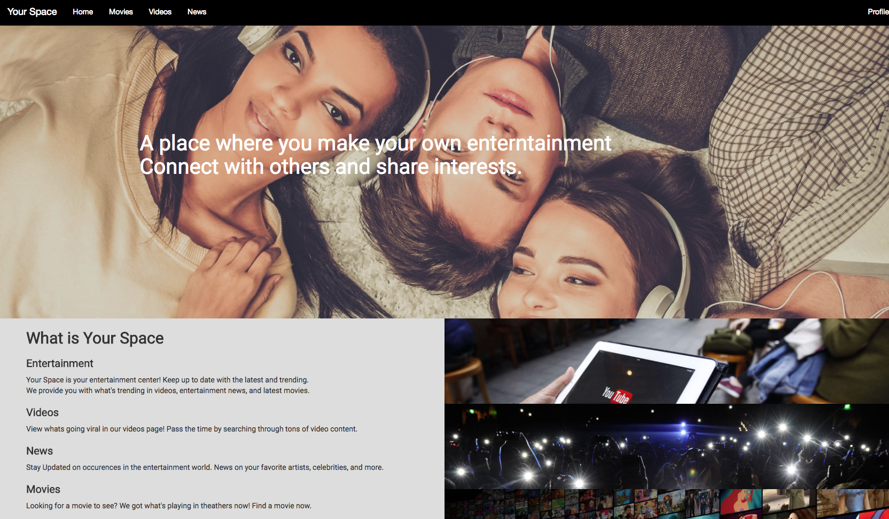
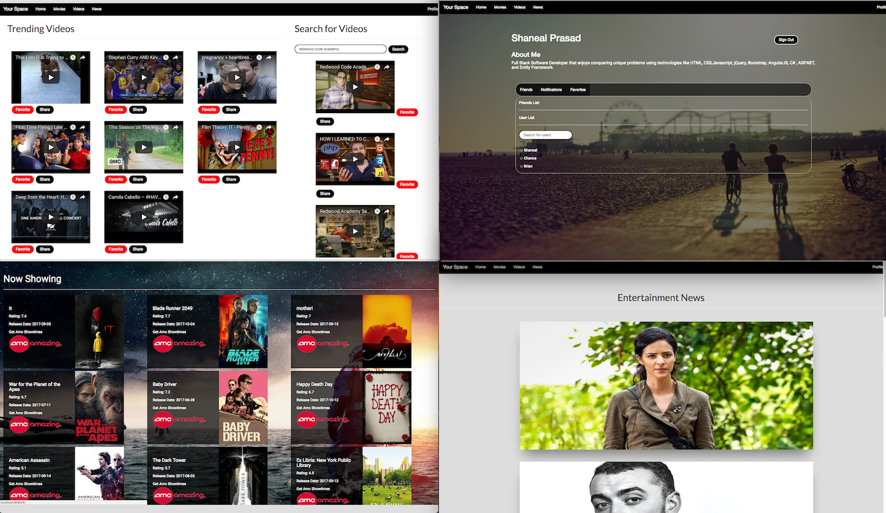

<h1>YourSpace</h1>

GameBook is a social media platform that brings together gamers from all around the world. Create a profile find your friends and build your own gaming empire. 

|  Technologies    |    | APIs        |
|-----------------:|    |-------------|
| HTML             |    | Youtube API |
| CSS              |    | News API    |
| Bootstrap        |
| JavaScript       |
| AngularJS        |
| C#               |
| ASP.NET MVC      |
| Entity Framework |

<h2>
Team:
Brian Canlas - UI/UX Developer 
Shaneal Prasad - Full Stack Developer
Chance Hernandez - Full Stack Developer
</h2>

<h3>Length: 2 week sprint</h3>

<h3>User Model Example:</h3>

| Parameters    | Value              | Description                 | Example                                      |
|---------------|--------------------|-----------------------------|----------------------------------------------|
| Username      | String             | User`s display name         | "b00oo00m3r4ng"                              |
| Firstname     | String             | User`s firstname            | "Shaneal"                                    |
| Lastname      | String             | User`s lastname             | "Prasad"                                     |
| Email         | String             | User`s email                | "shanealprasadsp@gmail.com"                  |
| Password      | String             | User`s Password             | "password"                                   |
| ProfilePic    | String             | User`s Profile Pic          |                                  |
| Online        | Bool               | User`s Online Status        | true                                         |
| Friends       | List<User>         | User`s Friends List         | [ User , User , User ]                       |
| Notifications | List<Notification> | User`s Notifications List   | [Notification , Notification , Notification] |
| Favorites     | List<Favorite>     | User`s Favorite Videos List | [Favorite , Favorite , Favorite]             |
| AboutMe       | String             | User`s self description     | "Full Stack Software Developer"              |

<h3>Challenges</h3>
    <ul>
        <li>Using what we learned from previous projects to provide clean code.</li>
        <li>Implementing new APIs</li>
        <li>Making everything work dynamically</li>
        <li>Using the youtube api and allowing our users to favorite videos</li>
        <li>Using the youtube api and allowing our users to share videos with each other</li>
        <li>Tons of .NET bugs that had to be fixed</li>
    </ul>